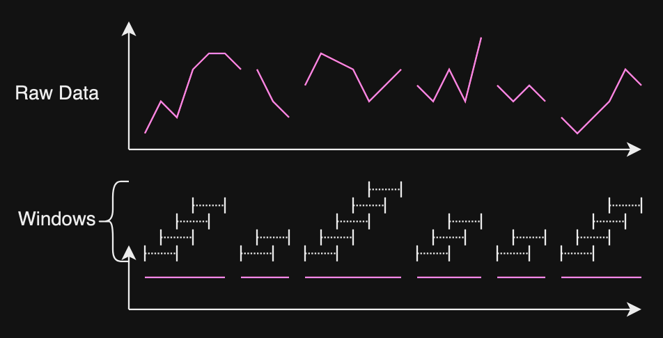
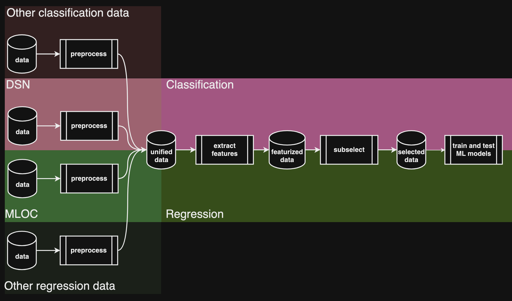
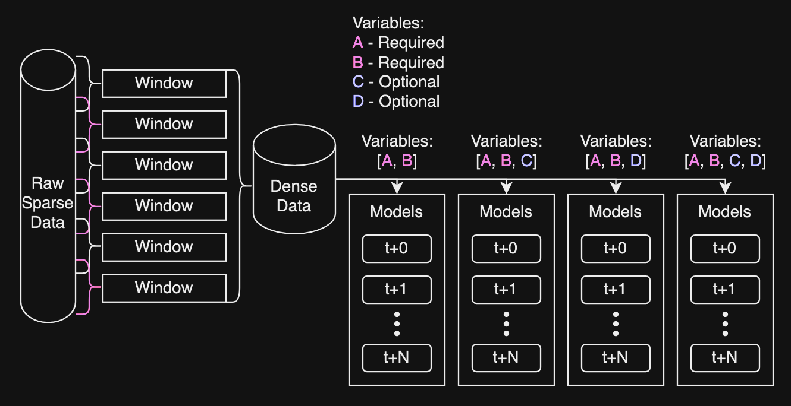

# Time Series Forecasting Evaluation and Deployment (TimeFED)

TimeFED is a machine learning system for Time series Forecasting, Evaluation and Deployment.

Prediction and forecasting require building models from historical data in order to predict future observations.  The most well-known forecast types are related to weather, finance (e.g., stock market) and business (e.g., earnings prediction); however, nearly all industries and research disciplines need to perform some type of prediction on time series data, which is data that is regularly observed in time.  

Many existing software packages require data to be machine learning (ML) ready.  For time series data, that means there are no missing observations in the data streams, or missing observations can be interpolated easily using standard techniques.  Also, packages tend to assume one of two types of data:
* A continuous stream of data (referred to as data streams).  Usually there are several streams of data collecting in time together.  We refer to this type of data are multivariate time series streams.
* A set of time series (may be multivariate) with distinct start and end times.  We refer to this data as multivariate time series tracks.

TimeFED was created in response to the following data realities:

* Data contains significant gaps (sometimes on the order of months or years) due to sensor outages
* Data are not sampled at the same rates
* Time series data can be in stream or track form

The Machine Learning and Instrument Autonomy group at JPL has built an infrastructure for time series prediction and forecasting that respects these realities.

## Setup

Clone the repo via `git pull https://github.jpl.nasa.gov/jamesmo/TimeFED.git`

### Environment

This project uses Conda to manage the Python environment required to run the scripts. The packages may be specifically set so it is recommended to use the environment file as provided.

1. Ensure [Conda](https://docs.conda.io/en/latest/miniconda.html) is installed.
2. Create a new conda environment via `conda create -n timefed python=3.10` (any version of python >= 3.10 is timefed compatible)
3. Activate the environment via `conda activate timefed`
4. CD to the TimeFED github top-level directory.  Ensure `setup.cfg` is in the current working directory.
5. Run `pip install .`.

## Getting Started

TimeFED is a pipeline system that essentially connects independent scripts together to prepare timeseries datasets for machine learning models and then trains and tests models. This is all done via a configuration YAML file and the TimeFED CLI. The CLI is accessed via the `timefed` command in a terminal:

```bash
$ timefed --help
Usage: timefed [OPTIONS] COMMAND [ARGS]...

  TimeFED is a machine learning system for Time series Forecasting, Evaluation
  and Deployment.

Options:
  --help  Show this message and exit.

Commands:
  config  mlky configuration commands
  run     Executes the TimeFED pipeline
```

There are two primary commands, `config` and `run`:
- The `config` command is used for generating new template configuration files, validating an existing config, or simply printing what a patched config may produce.
- The `run` command enters the TimeFED pipeline and executes the various pieces of it, depending on how it is configured.

### Configuration

The TimeFED system uses [mlky](https://jammont.github.io/mlky/) for its configuration module to validate users' configs and enable quick generation of experiment config setups. To begin, generate a new config via the CLI:

```bash
$ timefed config generate
Wrote template configuration to: generated.yml
```

This will create a configuration file using the TimeFED default parameters. There are many options to tweak the system, be sure to read the comment for an option before modifying it.

```bash
$ cat generated.yml
generated:                    #   | dict  | Generated via mlky toYaml
  cores: 10                   #   | int   | Number of cores to use for multiprocessing
  log:                        #   | dict  | Controls the logger
    file: timefed.log         #   | str   | File to write log outputs to. Omit to not write to file
    mode: write               #   | str   | File write mode, ie: `write` = overwite the file, `append` = append to existing
    level: DEBUG              #   | str   | Logger level. This is the level that will write to file if enabled
    terminal: DEBUG           #   | str   | The terminal level to log, ie. logger level to write to terminal. This can be different than the file level
    mlflow: False             #   | bool  | Enables MLFlow logging
... # truncated for README
  extract:                    #   | dict  | Options for the `extract` module
    enabled: True             # * | bool  | Enables/disables this module in a pipeline execution
    cores: 10                 #   | int   | Number of cores to use for the extract module
    method: tsfresh           # * | str   | Window processing method
    file: preprocess.h5       # * | str   | Path to an H5 file to read from / write to
    output: preprocess.h5.pqt # * | str   | Path to write the intermediary data products of the extract script
```

The default `generate` command will produce an **interpolated** configuration. There are magic strings under mlky that will replace/update the value for a configuration key. For example, a non-interpolated config can be generated via:

```bash
$ timefed config generate -ni -f raw-generated.yml
Wrote template configuration to: raw-generated.yml
$ cat raw-generated.yml
generated:                         #   | dict  | Generated via mlky toYaml
  cores: ${!os.cpu_count}          #   | int   | Number of cores to use for multiprocessing
  log:                             #   | dict  | Controls the logger
    file: timefed.log              #   | str   | File to write log outputs to. Omit to not write to file
    mode: write                    #   | str   | File write mode, ie: `write` = overwite the file, `append` = append to existing
    level: DEBUG                   #   | str   | Logger level. This is the level that will write to file if enabled
    terminal: ${.level}            #   | str   | The terminal level to log, ie. logger level to write to terminal. This can be different than the file level
    mlflow: False                  #   | bool  | Enables MLFlow logging
... # truncated for README
  extract:                         #   | dict  | Options for the `extract` module
    enabled: True                  # * | bool  | Enables/disables this module in a pipeline execution
    cores: ${cores}                #   | int   | Number of cores to use for the extract module
    method: tsfresh                # * | str   | Window processing method
    file: ${preprocess.file}       # * | str   | Path to an H5 file to read from / write to
    output: ${preprocess.file}.pqt # * | str   | Path to write the intermediary data products of the extract script
```

In the above example, the following magics are present:

- `${!` means to "execute a function". A limited number of functions are presently supported. `${!os.cpu_count}` will execute the `os.cpu_count()` function and replaces the value. In this example, this value is `10`.
- `${` and `${.` refer to other keys in the config. `${` is the **absolute** path along the config, while `${.` is the **relative** path. In other words, `${cores}` refers to `generated.cores`, while `${.level}` is relative to its current section, so it points it `generated.log.level`.

Note that this configuration assumes a user will using mlky patching, in which case the absolute pathing will be one level higher. That is why the magics are `${cores}` instead of `${generated.cores}`, as the `generated` section will be patched away.

These magics are important and useful for patching sections of the configuration together to create a new configuration setup. Consider the following configuration:

```yaml
generated:
  ... # Truncated

# Default Overrides

default:
  mlky.patch: generated
  name: default
  log:
    file: ${output}/${name}.log
  preprocess:
    file: ${output}/${name}.h5
  subselect:
    metadata: ${output}/${name}.metadata.pkl
  model:
    model:
      file: ${output}/${name}.model.pkl
    output:
      scores: ${output}/${name}.scores.pkl
      predicts: ${output}/${name}.predicts.h5

# Systems

local:
  mlky.patch: default
  input: .
  output: .
  data: .
  preprocess:
    tracks: ${data}/v4.MMS.tracks.h5
    drs: ${data}/v3.drs.h5

mlia:
  mlky.patch: default
  input: /data/mlia/timefed/experiments
  output: /data/mlia/timefed/experiments
  data: /data/mlia/timefed/experiments
  preprocess:
    tracks: ${data}/v4.MMS.tracks.h5
    drs: ${data}/v3.drs.h5

# Runs

mms:
  name: mms
  preprocess:
    only:
      drs:
        - RFI
        - SC
    features:
      diff:
        - CARRIER_SYSTEM_NOISE_TEMP
        - AGC_VOLTAGE
    subsample:
      neg_ratio: 1
  extract:
    roll:
      window: 5 min
      frequency: null

mms1:
  mlky.patch: mms
  name: mms1
  preprocess:
    only:
      missions:
        - MMS1

gnss:
  name: gnss
  preprocess:
    enabled: false
    file: ${output}/gnss_multi.h5
  extract:
    enabled: true
    method: passthrough
    roll:
      window: 14D
      frequency: null
      step: 7D
```

The above configuration has 7 sections:
  - `generated`
  - `local`
  - `mlia`
  - `mms`
  - `mms1`
  - `gnss`

These sections can be patched together to override keys and values. The patching syntax is the section names delineated by a `<-`. For example,

- `generated<-default` will override keys/values in the `generated` section with those in the `default` section.
- `generated<-default<-local<-mms` this first patches `generated` with `default`, then patches `local` onto that, and finally `mms` onto that. The section precedence increases from left to right.

This can be tested via the `timefed config print` command

```bash
$ timefed config print --help
Usage: timefed config print [OPTIONS]

  Prints the yaml dump for a configuration with a given patch input

Options:
  -c, --config TEXT              Path to a mlky config
  -p, --patch TEXT               Patch order for mlky
```

Example: `timefed config print -c generated.yml -p "generated<-patch"`

The above configuration example also shows in-line patching via the `mlky.patch` key in a section. If these sections are included in the patch string then they will auto-patch other sections. For example, `generated<-default<-local<-mms<-mms1` is the same as `local<-mms1` because `local` auto-patches `default`, which auto-patches `generated`, while `mms1` auto-patches `mms`.

This capability is very important to the scientists that created this system to quickly explore new configuration setups without creating new config files for each experiment. This enabled building complex configurations that built on previous experiments while maintaining experiment traceability.

### Modules

TimeFED consists of four primary modules:

- `preprocess` - These are scripts specific to a dataset. Out of the box, TimeFED provides a preprocess script for DSN data
- `extract` - This "extracts" windows of data from the preprocessed dataset by rolling over a time index and discovering ML-ready subsets of data. The definition of ML-ready depends on the configuration, but generally it requires all features in a given window to be fully dense. This ensures missing observations / gaps are handled and removed. The output of this module is generally the windows flattened to some feature-extraction strategy, such as rotating the window to be 1 dimensional, or using tsfresh to extract features from the window. 
- `subselect` - Train/test splits the extracted dataset to prepare for creating ML models. This module contains an interactive component to discover the optimal split-date.
- `model` - Trains and tests machine learning models using the train/test split.

At a high-level, this pipeline looks like the following flowchart:



The TimeFED pipeline supports both classification and regression ML models within each module.

At the end of the pipeline, a trained model will be saved to disk and the scores made available to the user to further generate plots or other analysis. These models may be taken elsewhere and are ready for deployment.

For example, by mixing different windowing strategies together to create a cluster of models, a user may generate a deployment environment where certain higher-performance models are selected if optional variables are available.


